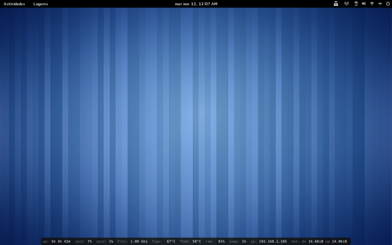

Conky Horizontal Minimalist
===========================
A minimalist horizontal config file for conky 1.10.0

----

Install
----
Rename and place `conkyrc` file and `conky` directory to `~/.conkyrc` and `~/.conky`
 

Notes
-----
* Information of wired connections has priority over wireless when both are connected.
* Change name of your nets interface in `.conkyrc`
* Require `lm-sensors` and `hddtemp` for temperature measuring
* Uses lua for semitransparency background
* Using since Ubuntu 9.10 
* Last tested on Ubuntu Gnome 15.10, Ubuntu 15.10
 

Screenshots
------------
**Close up**

 
**Full screen**

 

Links
-----
Code of `draw_bg.lua` file by [londonali1010](http://londonali1010.deviantart.com/)

More screenshots at [davidhdz](http://davidhdz.deviantart.com/gallery/29796305)
 

Conky website: [http://github.com/brndnmtthws/conky](http://github.com/brndnmtthws/conky)

Ubuntu website:  [http://www.ubuntu.com/](http://www.ubuntu.com/)

Ubuntu Gnome website: [http://ubuntugnome.org/](http://ubuntugnome.org/) 

-----
